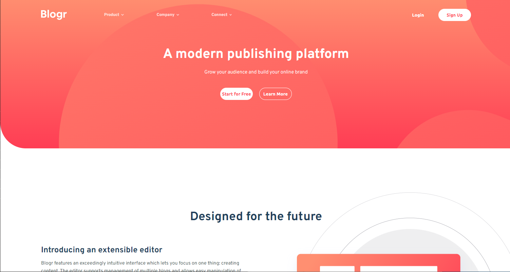
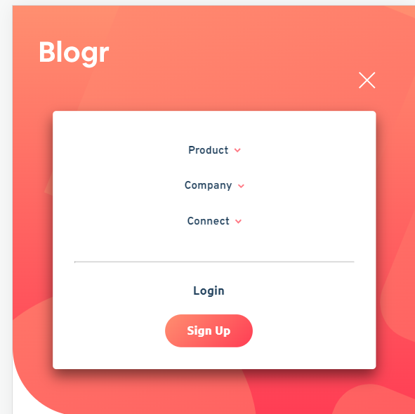

# Frontend Mentor - Blogr landing page solution

This is a solution to the [Blogr landing page challenge on Frontend Mentor](https://www.frontendmentor.io/challenges/blogr-landing-page-EX2RLAApP). Frontend Mentor challenges help you improve your coding skills by building realistic projects.

## Table of contents

-  [Overview](#overview)
   -  [The challenge](#the-challenge)
   -  [Screenshot](#screenshot)
   -  [Links](#links)
-  [My process](#my-process)
   -  [Built with](#built-with)
   -  [What I learned](#what-i-learned)
   -  [Continued development](#continued-development)
   -  [Useful resources](#useful-resources)
-  [Author](#author)
-  [Acknowledgments](#acknowledgments)

**Note: Delete this note and update the table of contents based on what sections you keep.**

## Overview

### The challenge

Users should be able to:

-  View the optimal layout for the site depending on their device's screen size
-  See hover states for all interactive elements on the page

### Screenshot

### Links

-  Solution URL: (https://github.com/ThomasAurelius/fm_blogr-landing-page-main/blob/master/README-template.md)
-  Live Site URL:(https://thomasaurelius.github.io/fm_blogr-landing-page-main/)

## My process

### Built with

-  Semantic HTML5 markup
-  CSS custom properties
-  Flexbox
-  CSS Grid
-  Mobile-first workflow

### What I learned

## Author

-  Website - [Thomas Aurelius](https://www.thomasaurelius.com)
-  Frontend Mentor - [@thomasaurelius](https://www.frontendmentor.io/profile/thomasaurelius)
-  Twitter - [@thomasaurelius4](https://www.twitter.com/thomasaurelius4)

## Acknowledgments

Thank you to frontendmentor.io for these challenges!
